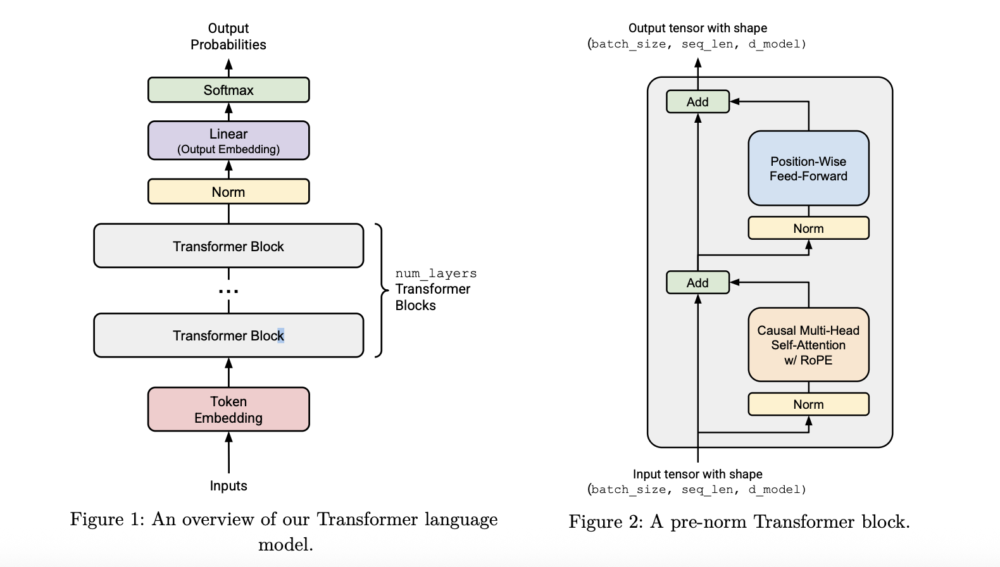
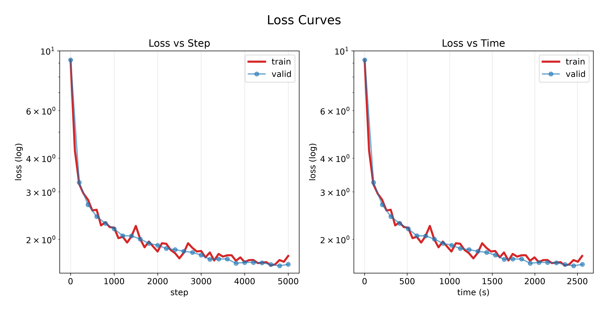
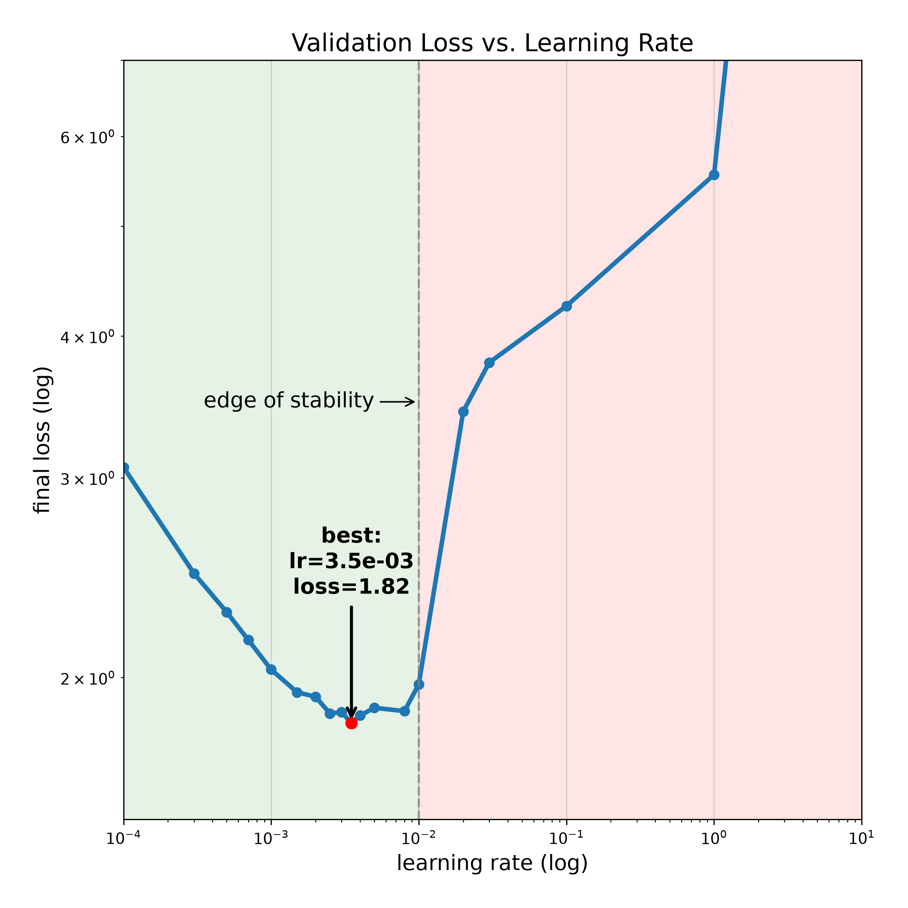

# MiniatureGPT — A Transformer Language Model from Scratch

A decoder-only Transformer language model (17M parameters) implemented **from scratch** in PyTorch. Trained on the TinyStories dataset on a single Apple-Silicon laptop (MPS), it generates coherent children's stories.

Built as a self-directed implementation of Stanford's [CS336](https://stanford-cs336.github.io/) Assignment 1.

## Highlights

- **From-scratch architecture**: hand-implemented multi-head self-attention (MHA), Rotary Position Embeddings (RoPE), SwiGLU FFN, RMSNorm, causal masking, and a byte-level BPE tokenizer with training.
- **Full training stack**: AdamW, cosine learning-rate schedule with linear warmup, gradient clipping, cross-entropy loss.
- **Infrastructure**: training loop, and checkpointing with resumption.
- **Result**: validation loss **1.61** $\le$ 2.00 on TinyStories (meets target for the low-resource config).
- **100× speedup**: diagnosed and fixed a severe training bottleneck, cutting per-step time from **50s to 0.5s** by vectorizing RoPE.
- **Experiments**: a 14-point learning-rate sweep mapping the full curve from undertraining through the optimum to divergence.

## Pre-norm TransformerLM architecture



| Hyperparameter             | Value                    |
| -------------------------- | ------------------------ |
| Parameters (non-embedding) | 17M                      |
| Vocab size                 | 10,000 (byte-level BPE)  |
| Vatch size                 | 32                       |
| Context length             | 256                      |
| d_model / d_ff             | 512 / 1344               |
| layers / heads             | 4 / 16                   |
| RoPE $\Theta$              | 10,000                   |
| training steps             | 5,000                    |
| Total tokens processed     | 41M                      |
| Learning rate              | 0.0035 (cosine + warmup) |

## Results

### Training & validation loss

The model converges from a random-init loss of ~9.25 ($\approx \ln 10000$) to a validation loss of 1.61.



### Learning-rate sensitivity

A sweep over 14 learning rates (1e-4 to 10) shows a clear U-shaped curve. The optimum sits near **3.5e-3**; AdamW + gradient clipping keep training stable across two orders of magnitude, with sharp degradation past the "edge of stability" (~1e-2).



### Sample generation

Generated with top-p (nucleus) sampling and temperature scaling:

```
Once upon a time, there was a little girl named Sue. Sue loved to play with her toys and make new friends. One day, Sue found a big, shiny rock in her yard. She thought it was very special.
Sue showed the rock to her friend, Tim. Tim said, "Wow, that's a big rock! Can I play with it?" Sue said, "Yes, but be careful. It's very special to me." Tim and Sue played with the rock all day. They had so much fun.
But then, something unexpected happened. The rock started to move! It was not a rock at all. It was a big, friendly turtle! The turtle said, "Hello, Sue and Tim! I am a magic turtle. I can grant you one wish." Sue and Tim were very surprised. They wished for more fun days together. The magic turtle made their wish come true, and they all became best friends.
```

## Repository structure

```
cs336_basics/
├── tokenizer.py, train_bpe.py        # byte-level BPE tokenizer
├── embedding.py, linear.py, rmsnorm.py
├── rope.py                           # Rotary Position Embeddings
├── scaled_dot_product_attention.py
├── multihead_self_attention(_with_rope).py
├── positionwise_feedforward.py, silu.py   # SwiGLU FFN
├── transformer_block.py, transformer_lm.py
├── cross_entropy.py, softmax.py
├── adamw.py, gradient_clipping.py, learning_rate_schedule.py
├── data_loading.py, checkpointing.py
├── training_together.py              # main training loop
├── evaluate.py                       # periodic validation
├── decoding.py, generate.py          # top-p / temperature sampling
└── plot_training.py, plot_learning_rate.py   # visualization
```

## Usage

Train on TinyStories (default device: `mps`):

``` bash
uv run python -m cs336_basics.training_together \
  --vocab_size 10000 --context_length 256 --d_model 512 \
  --num_layers 4 --num_heads 16 --d_ff 1344 --rope_theta 10000 \
  --batch_size 32 --num_steps 5000 --max_l2_norm 1.0 --device mps \
  --max_learning_rate 3.5e-3 --min_learning_rate 1e-5 \
  --warmup_iters 200 --cosine_cycle_iters 5000
```

Generate text from a checkpoint:

``` bash
uv run python -m cs336_basics.generate \
  --checkpoint output/checkpoints/step_5000.pt \
  --prompt "Once upon a time"
```

## Notes

- The 100× bottleneck: the initial RoPE implementation applied rotations with a nested Python loop over (sequence position × frequency), launching ~200k tiny GPU kernels per forward pass. Rewriting it as batched tensor operations (gather precomputed cos/sin tables, even/odd slicing, broadcasted rotation) cut per-step time from ~50s to ~0.5s on MPS.
- Stability vs. learning rate: AdamW normalizes per-parameter updates to roughly unit scale, and gradient clipping caps the global norm — together they keep training stable across lr ∈ [1e-4, 1e-2], far wider than raw SGD would allow. Catastrophic divergence appears only at lr ≥ 1, as oscillatory instability.

## Acknowledgments

Implemented following the Stanford CS336 (Language Modeling from Scratch) Assignment 1 handout.

AI usage adhered to [AI Agent Guidelines for CS336 at Stanford](CLAUDE.md).